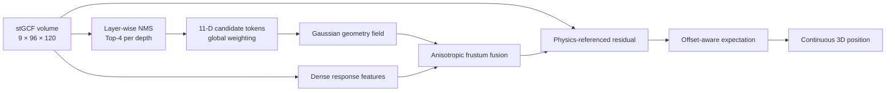

<div align="center">

# GeoPeak3D

### Geometry-Guided Multi-Peak Disambiguation for 3D Acoustic Source Localization

[](https://www.python.org/)
[](https://pytorch.org/)
[](LICENSE)
[](http://www.glat.info/ma/av16.3/)

**Chenxu Yang · Chenyu Wang · Zhenhuan Xu · Yidi Li · Dimitrios Kanoulas**

Taiyuan University of Technology · University College London

[[Paper](#citation)] · [[Demo](#qualitative-demo)] · [[Data](#data-preparation)] · [[Training](#training)] · [[Evaluation](#evaluation)]

</div>

---

GeoPeak3D is an audio-only framework for single-source 3D localization in reverberant environments. Instead of committing to the strongest stGCF response, it preserves competing peaks, represents their weighted geometry on a calibrated view frustum, and learns to correct the acoustic response distribution. Inference uses microphone signals and camera calibration parameters—no RGB image is required.

## Highlights

- **Multi-peak reasoning:** layer-wise NMS retains four hypotheses at every depth.
- **Geometry-aware fusion:** a learned candidate field is fused with the complete stGCF volume.
- **Frustum-native encoder:** separate image-plane and ray-wise operators respect calibrated viewing geometry.
- **Continuous 3D output:** residual response correction and offset-aware expectation avoid voxel-center quantization.



## Results on AV16.3

The reported values are averages over ten independent runs. Lower is better.

| Method | seq08 3D MAE (cm) | seq11 | seq12 | Average | 2D MAE (px) |
|:--|--:|--:|--:|--:|--:|
| GCF | 38.9 | 34.0 | 48.0 | 40.3 | 37.8 |
| stGCF | 31.1 | 27.9 | 39.2 | 32.7 | 22.9 |
| stGCF + soft-argmax | 18.6 | 20.6 | 26.9 | 22.0 | 21.5 |
| ViDAL-Net | 18.9±0.1 | 26.7±0.7 | 28.1±0.1 | 24.6±0.2 | 21.6±0.4 |
| **GeoPeak3D** | **16.6±1.0** | **18.5±0.4** | **24.0±0.7** | **19.7±0.4** | **18.1±0.5** |

On samples whose strongest raw stGCF peak is misleading, GeoPeak3D reduces 3D MAE from **54.6 cm** to **28.6 cm**.

## Qualitative demo

<div align="center">
  <a href="assets/demo.mp4">
    
  </a>
  <br>
  <sub>Reserved for the paper-effect video. Add <code>assets/demo.mp4</code> or replace this link with a GitHub-hosted video URL before release.</sub>
</div>

## Repository layout

```text
GeoPeak3D/
├── geopeak3d/
│   ├── model.py        # complete GeoPeak3D architecture
│   ├── data.py         # AV16.3 stGCF dataset interface
│   └── geometry.py     # calibrated 3D back-projection
├── tools/
│   ├── train.py        # paper training protocol
│   ├── evaluate.py     # sequence-camera 3D/2D evaluation
│   └── smoke_test.py   # lightweight model/API check
├── assets/             # README figures and demo-video slot
├── requirements.txt
└── LICENSE
```

Only the code required by the paper is included. Raw datasets, generated stGCF volumes, experiment logs, and checkpoints are intentionally excluded.

## Installation

```bash
git clone https://github.com/langlibai66/GeoPeak3D.git
cd GeoPeak3D

conda create -n geopeak3d python=3.10 -y
conda activate geopeak3d
pip install -e .
```

Verify the installation on CPU:

```bash
python tools/smoke_test.py
```

## Data preparation

1. Download AV16.3 sequences `01`, `02`, `03`, `08`, `11`, and `12`, together with `cam.mat` and `rigid010203.mat` calibration files.
2. Use the official [STNet repository](https://github.com/liyidi/STNet) to perform audio framing and generate the stGCF response volumes. Follow its `tools/prepareAudio.py`, `tools/prepare_gccphat.py`, and `GCF/stGCF.py` pipeline.
3. Arrange the generated arrays in the layout below. This repository does **not** redistribute AV16.3 or generated data.

```text
data/
├── seq01-1p-0000/
│   ├── gcf/
│   │   ├── cam1.npy          # [frames, 9, 96, 120]
│   │   ├── cam2.npy
│   │   └── cam3.npy
│   └── labels/
│       ├── gt2d_mouth_xy.npy # [frames, 3, 2], zero-based pixels
│       └── gt3d_xyz.npy      # [frames, 3], metres
├── seq02-1p-0000/
├── seq03-1p-0000/
├── seq08-1p-0100/
├── seq11-1p-0100/
├── seq12-1p-0100/
└── depth_evaluation/
    └── <sequence>/
        └── gt_camera_depths_m.npy  # [frames, 3]
```

The paper uses `seq01+seq02` for training, `seq03` for validation, and `seq08+seq11+seq12` for testing. Each camera view is treated as an independent sample.

## Training

The default command reproduces the paper settings: AdamW, learning rate `1e-3`, weight decay `1e-2`, batch size `32`, at most `15` epochs, and early-stopping patience `5`.

```bash
python tools/train.py \
  --data-root /path/to/data \
  --output-dir runs/geopeak3d \
  --batch-size 32 \
  --epochs 15 \
  --patience 5 \
  --seed 7
```

For the ten-run result in the paper, repeat training with ten independent random seeds and report mean ± standard deviation.

## Evaluation

`--calibration-root` must contain the AV16.3 `session08`, `session09`, and `session10` directories, each with `cam.mat` and `rigid010203.mat`.

```bash
python tools/evaluate.py \
  --data-root /path/to/data \
  --calibration-root /path/to/av16.3 \
  --checkpoint runs/geopeak3d/best.pt \
  --output results/test_metrics.csv
```

The evaluator writes per-sequence/per-camera 3D MAE (cm) and 2D MAE (px), then prints the nine-domain averages used in the paper.

## Citation

If this work is useful in your research, please cite it. Replace the venue fields below with the final publication metadata when available.

```bibtex
@article{yang2026geopeak3d,
  title   = {GeoPeak3D: Geometry-Guided Multi-Peak Disambiguation for 3D Acoustic Source Localization},
  author  = {Yang, Chenxu and Wang, Chenyu and Xu, Zhenhuan and Li, Yidi and Kanoulas, Dimitrios},
  year    = {2026}
}
```

## Acknowledgements

Data preparation and stGCF construction build on [STNet](https://github.com/liyidi/STNet). The repository layout and concise train/test presentation are inspired by [MSMD-AVT](https://github.com/moyitech/MSMD-AVT).

## License

Released under the [MIT License](LICENSE).
