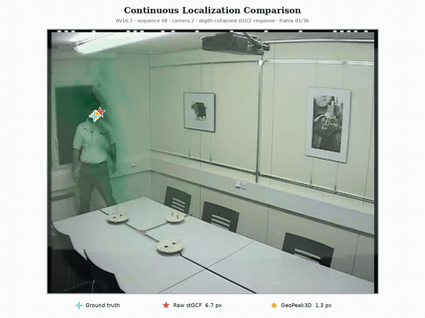
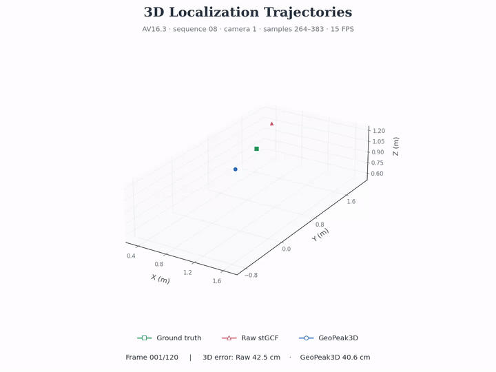

<div align="center">

# GeoPeak3D

### Geometry-Guided Multi-Peak Disambiguation for 3D Acoustic Source Localization

[](https://www.python.org/)
[](https://pytorch.org/)
[](LICENSE)
[](http://www.glat.info/ma/av16.3/)

[[Architecture](#architecture)] · [[Installation](#installation)] · [[Data](#data-preparation)] · [[Training](#training)] · [[Evaluation](#evaluation)] · [[Demo](#qualitative-demo)]

</div>

---

GeoPeak3D is an audio-only model for single-source 3D localization in reverberant environments. Given a calibrated stGCF volume, it retains competing response peaks, models their geometry on the view frustum, and predicts a continuous 3D source position. Inference requires microphone signals and camera calibration parameters, but no RGB images.

## Highlights

- **Multi-peak reasoning:** layer-wise NMS retains four hypotheses at every depth.
- **Geometry-aware fusion:** a learned candidate field is fused with the complete stGCF volume.
- **Frustum-native encoder:** separate image-plane and ray-wise operators respect calibrated viewing geometry.
- **Continuous 3D output:** residual response correction and offset-aware expectation avoid voxel-center quantization.

## Architecture

<div align="center">
  <a href="assets/network-architecture.pdf">
    
  </a>
  <br>
  <sub>GeoPeak3D network architecture. Click the figure to open the vector PDF.</sub>
</div>

## Qualitative demo

<div align="center">
  <a href="assets/demo.mp4">
    
  </a>
  <br>
  <sub>120 consecutive frames from AV16.3 sequence 08, camera 1. Click the preview for the high-resolution video.</sub>
</div>

The visualization places ground truth, the raw stGCF maximum, and the GeoPeak3D estimate in the same image coordinate system over an 8-second continuous window at 15 FPS. Green overlays show the depth-collapsed stGCF response. RGB frames are used only for visualization; localization remains audio-only.

Both methods use the same `GCF_visual_ssl_aligned` input volumes. Raw selects the global 3D maximum of each volume; GeoPeak3D uses continuous expectation decoding. The displayed errors are computed from the coordinates used in the animations.

For this selected window, mean 2D error is 47.42 px for Raw and 19.94 px for GeoPeak3D; mean 3D error is 35.59 cm and 15.85 cm, respectively. GeoPeak3D has lower error in 81/120 frames in 2D and 82/120 frames in 3D. These are clip-specific results, not full-test-set metrics. See the [verification summary](assets/demo-3d-coordinates.json).

### 3D trajectory visualization

<div align="center">
  <a href="assets/demo-3d.mp4">
    
  </a>
  <br>
  <sub>Click to play the 8-second 3D comparison at 15 FPS.</sub>
</div>

The trajectories accumulate over the same 120 consecutive samples (264–383) as the image-plane demo. Green squares indicate ground truth, red triangles raw stGCF, and blue circles GeoPeak3D. All coordinates are in the calibrated world frame, in metres, with fixed axes and equal spatial scale. This selected qualitative example includes every sample in the window; no temporal smoothing is applied.

The [per-frame coordinates](assets/demo-3d-coordinates.csv) are included to reproduce the animation. With Matplotlib installed and FFmpeg on your path, run:

```bash
python tools/render_3d_demo.py \
  --input assets/demo-3d-coordinates.csv \
  --output assets/demo-3d.mp4 --fps 15 \
  --subtitle "AV16.3 · sequence 08 · camera 1 · samples 264–383 · 15 FPS"
```

`tools/build_demo_coordinates.py` rebuilds the coordinate table from the aligned dataset, calibration files, and a model-output NPZ (`raw`, `final`, and `gt` arrays). It checks that the model-input heatmaps match the volumes used for Raw and that image-plane GT labels match before exporting coordinates and metrics. Run `python -m tools.build_demo_coordinates --help` for arguments.

## Installation

```bash
git clone https://github.com/langlibai66/GeoPeak3D.git
cd GeoPeak3D

conda create -n geopeak3d python=3.10 -y
conda activate geopeak3d
pip install -e .
```

Optional sanity check:

```bash
python -m unittest discover -s tests -v
```

## Data preparation

This repository starts from precomputed stGCF volumes; raw-audio preprocessing is not included.

1. Download AV16.3 sequences `01`, `02`, `03`, `08`, `11`, and `12`, together with the `cam.mat` and `rigid010203.mat` calibration files.
2. Use [STNet](https://github.com/liyidi/STNet) to perform audio framing and generate the stGCF response volumes. The relevant upstream scripts are `tools/prepareAudio.py`, `tools/prepare_gccphat.py`, and `GCF/stGCF.py`.
3. Convert the generated outputs to NumPy arrays and arrange them as shown below. AV16.3 and generated data are not redistributed in this repository.

```text
data/
├── seq01-1p-0000/
│   ├── gcf/
│   │   ├── cam1.npy          # [frames, 9, 96, 120]
│   │   ├── cam2.npy
│   │   └── cam3.npy
│   └── labels/
│       ├── gt2d_mouth_xy.npy # [frames, 3, 2], zero-based pixels
│       └── gt3d_xyz.npy      # [frames, 3], metres
├── seq02-1p-0000/
├── seq03-1p-0000/
├── seq08-1p-0100/
├── seq11-1p-0100/
├── seq12-1p-0100/
└── depth_evaluation/
    └── <sequence>/
        └── gt_camera_depths_m.npy  # [frames, 3]
```

The default split is `seq01+seq02` for training, `seq03` for validation, and `seq08+seq11+seq12` for testing. Camera views are treated as independent samples.

## Training

The default configuration uses AdamW, learning rate `1e-3`, weight decay `1e-2`, batch size `32`, at most `15` epochs, and early-stopping patience `5`.

```bash
python tools/train.py \
  --data-root data \
  --output-dir runs/geopeak3d \
  --batch-size 32 \
  --epochs 15 \
  --patience 5 \
  --seed 7
```

Training writes `best.pt`, `latest.pt`, and `history.csv` to the selected output directory.

## Evaluation

`--calibration-root` must contain the AV16.3 `session08`, `session09`, and `session10` directories, each with `cam.mat` and `rigid010203.mat`.

```bash
python tools/evaluate.py \
  --data-root data \
  --calibration-root av16.3 \
  --checkpoint runs/geopeak3d/best.pt \
  --output results/test_metrics.csv
```

The evaluator writes per-sequence/per-camera 3D MAE (cm) and 2D MAE (px), then prints the nine-domain averages.

## Repository layout

```text
GeoPeak3D/
├── geopeak3d/
│   ├── model.py        # GeoPeak3D architecture
│   ├── data.py         # stGCF dataset interface
│   └── geometry.py     # calibrated 3D back-projection
├── tools/
│   ├── train.py        # training entry point
│   └── evaluate.py     # evaluation entry point
├── tests/
│   └── test_model.py   # lightweight model test
├── assets/             # architecture figure and demo assets
├── pyproject.toml
└── LICENSE
```

The repository contains the core implementation only. Datasets, generated stGCF volumes, experiment logs, and checkpoints are intentionally excluded.

## Acknowledgements

Data preparation and stGCF construction build on [STNet](https://github.com/liyidi/STNet).

## License

Released under the [MIT License](LICENSE).
